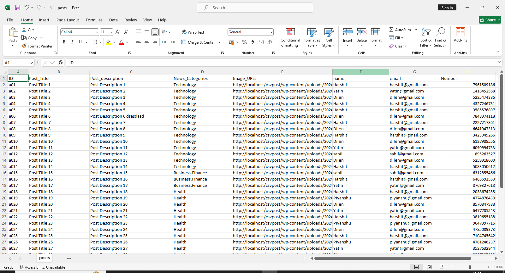

# CSV to WordPress Post Importer

This project demonstrates how to import data from a CSV file into WordPress posts using a custom template and styles in the Hestia child theme.

## **Overview**

The project involves importing data from a CSV file (`post.csv`) into WordPress posts. The Hestia theme is used with a custom child theme where a new template (`template-news.php`) and custom styles (`custom-style.css`) are applied.

## **Features**

- **CSV Import**: Functionality to read from a CSV file and create WordPress posts.
- **Custom Template**: A custom page template (`template-news.php`) to display the imported posts.
- **Custom Styles**: Additional styles defined in `custom-style.css` to style the news posts page.
- **Hestia Theme**: Utilizes the Hestia theme as the base for the child theme.

## **Screenshots**

### CSV Import Process

### Desktop View

### Mobile View

## **Folder Structure**

- **`wp-content/themes/hestia-child/`**: The child theme folder for Hestia.
  - **`template/`**: Contains the custom template file for displaying posts.
    - **`template-news.php`**: Custom template for displaying imported posts.
  - **`custom-css/`**: Contains custom CSS files for styling.
    - **`custom-style.css`**: Custom CSS for the news posts page.
  - **`post.csv`**: The CSV file containing data to be imported as WordPress posts.
  - **`functions.php`**: Contains the main code for importing CSV data to WordPress posts.

## **How It Works**

1. **CSV File**: The `post.csv` file contains the data to be imported into WordPress. Each row in the CSV file represents a post with fields like title, content, and other metadata.

2. **Functionality**:
   - **CSV to Post Import**: Code in `functions.php` handles reading the CSV file and creating WordPress posts from the data.
   - **Template**: `template-news.php` displays the imported posts.
   - **Styles**: `custom-style.css` provides custom styles for the post display.

3. **Output**: You can view the imported posts on the [All News](http://localhost/csvpost/all-news/) page.

